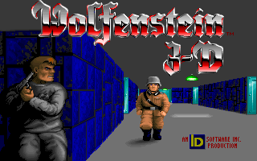
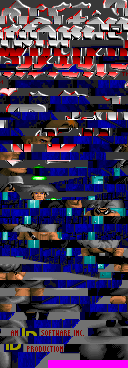
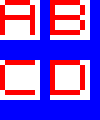

# grid-img-util
Command line utilities for editing grid-based (tile-based) images. Both programs require Python and the [Pillow module](https://python-pillow.org).

Table of contents:
* [a note about the files](#a-note-about-the-files)
* [unique-tiles](#unique-tiles)
* [resize-grid](#resize-grid)

## a note about the files
These files are only meant to be used by the author:
* `*-test.sh` (test scripts; they delete files so don't run them without reading them first)
* `*-test.md5` (hashes of correct output files)
* `test-in/*.png` (test images to be read)

## unique-tiles
Reads an image and writes a PNG image with distinct tiles (rectangles of specified size) only.

Some of the sample images are from *Commander Keen: Secret of the Oracle* and *Wolfenstein 3D* by id Software.

Example (original on the left, output with default settings on the right):

### Command line arguments
*options* *inputFile* *outputFile*
* *options* are any number of these, separated by spaces:
  * `--width N`: The width of each tile, in pixels. `N` is 1 to 256. The default is 8.
  * `--height N`: The height of each tile, in pixels. `N` is 1 to 256. The default is 8.
  * `--order V`: Order of tiles in the output image. `V` is one of these:
    * `o`: original (the first tile to occur in *inputFile* will occur first in *outputFile*; this is the default)
    * `p`: first by brightnesses of pixels, top left pixel first, then by original order
    * `a`: first by average brightness of each tile, then by original order
    * `c`: first by number of unique colors, then by original order
    * `cp`: first by number of unique colors, then by brightnesses of pixels, then by original order
    * `ca`: first by number of unique colors, then by average brightness of each tile, then by original order
  * `--verbose`: Print information.
* *inputFile*: Required. Image file to read (e.g. PNG). The width and height must be multiples of tile size. No alpha channel.
* *outputFile*: Required. PNG file to write. Will contain every distinct tile in the input file once. The width will be 16 times the tile size. The height will be a multiple of tile size.

### Example
`python3 uniquetiles.py --width 20 --height 10 input.png output.png`

## resize-grid
A command line tool that reads a grid-based image and writes a PNG image with a larger grid. Each tile (rectangle) in the grid will be padded to the new size by adding the specified background color to the right and bottom edges.

### Command line arguments
*options* *inputFile* *outputFile*
* *options* are any number of these, separated by spaces:
  * `--iw N`: Width of each tile in input file, in pixels. `N` is 1 to 256. The default is 8.
  * `--ih N`: Height of each tile in input file, in pixels. `N` is 1 to 256. The default is 8.
  * `--ow N`: Width of each tile in output file, in pixels. `N` is 1 to 256. The default is 9.
  * `--oh N`: Height of each tile in output file, in pixels. `N` is 1 to 256. The default is 9.
  * `--bgcolor C`: Background color in output file. Hexadecimal RRGGBB code, `000000`&ndash;`ffffff`. The default is `000000` (black).
* *inputFile*: Image file to read (e.g. PNG).
  * Required.
  * The width must be a multiple of input tile width.
  * The height must be a multiple of input tile height.
  * No alpha channel.
* *outputFile*: PNG file to write.
  * Required.
  * The width will be (input image width) / (input tile width) &times; (output tile width).
  * The height will be (input image height) / (input tile height) &times; (output tile height).

### Example
`python3 resizegrid.py resizegrid-before.png resizegrid-after.png --iw 8 --ih 8 --ow 10 --oh 12 --bgcolor 0000ff`

Before and after:

(The images were actually 16&times;16 and 20&times;24 pixels; they've been resized to 5x their original size afterwards.)
